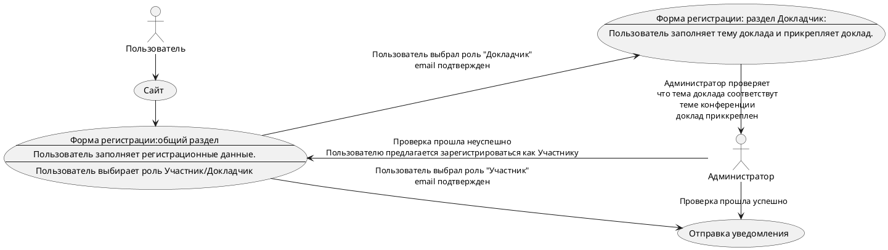

# Описание требований и архитектуры

## Введение
<!-- Общее краткое описание создаваемой системы -->
В рамках курса осуществляется проектирование решения на основе [постановки задачи от "заказчика"](../../task.md).

- [Описание требований и архитектуры](#описание-требований-и-архитектуры)
  - [Введение](#введение)
  - [Заинтересованные стороны](#заинтересованные-стороны)
  - [Бизнес-контекст (бизнес-требования)](#бизнес-контекст-бизнес-требования)
  - [Глоссарий](#глоссарий)
  - [Модель предметной области](#модель-предметной-области)
  - [Требования к системе](#требования-к-системе)
    - [Сценарии использования (Use case)](#сценарии-использования-use-case)
    - [Функциональные требования](#функциональные-требования)
    - [Нефункциональные требования/Требования к атрибутам качества](#нефункциональные-требованиятребования-к-атрибутам-качества)
    - [Ограничения](#ограничения)
  - [Архитектура](#архитектура)
    - [Журнал архитектурных решений](#журнал-архитектурных-решений)
    - [Контекст решения](#контекст-решения)
    - [Компонентная архитектура](#компонентная-архитектура)
    - [Реализация сценариев использования](#реализация-сценариев-использования)
    - [Программные интерфейсы](#программные-интерфейсы)
    - [Схема развертывания](#схема-развертывания)
  
## Заинтересованные стороны
<!-- Перечень заинтересованных сторон и их интересов по отношению к создаваемой системе. 
Подробнее: https://confluence.mts.ru/pages/viewpage.action?pageId=399975538 
-->
| Заинтересованная сторона | Интересы                          |
|:-------------------------|:----------------------------------|
| Организаторы             |Проведение мероприятия, увеличение охвата заинтересованных лиц и ЦА, привлечение спонсоров |	
| Докладчики | Продвижение докладчика, развитие личного бренда, популяризация темы|	 
| Целевая аудитория	|	 Интересная тема форума, новые докладчики, обмен мнениями, личное развитие|
| Спонсоры форума | Реклама своих продуктов и услуг, популяризация бренда|
|Городские власти | Популяризация бренда, выход на новую аудиторию, лояльность аудитории, реклама продуктов и услуг| 
|Правообладатели товарных знаков|Популяризация бренда, выход на новую аудиторию,лояльность аудитории, реклама продуктов и услуг|    

## Бизнес-контекст (бизнес-требования)
<!-- Общее описание бизнес-контекста создаваемой системы (автоматизируемой деятельности), список бизнес-целей заинтересованных сторон 
Подробнее: https://confluence.mts.ru/pages/viewpage.action?pageId=399973845
--> Приложение должно содержать, следующие функциональные блоки:
- Работа с докладчиками
- Работа с расписаниями
- Проведение конференции (трансляция, сбор обратной связи)

## Глоссарий
<!-- Содержит основные понятия и термины предметной области  
Подробнее: https://confluence.mts.ru/pages/viewpage.action?pageId=375782595
-->
| Понятие                        | Сокращение                         | Определение                       |
|:-------------------------------|:-----------------------------------|:----------------------------------|
| Регистрация                    |  | Процесс получения доступа к мероприятию|
| Регламеннт | | Лимит времени предоставляемый для презентации доклада |
| Расписание | | Последовательность и длительность выступлений  |
| Пользователь || Лицо желающее принять участие в конференции
| Участник | |Зарегистрированный польззователь с возможностью просмотра выступлений | 
| Докладчик||Выступающий участник |
|Администратор||Участник не принимающий непосредственного участия в конференци, обладающий правами доступа ко всем данным системы|
|Технический специалист|| Участник не принимающий непосредственного участия в конференци, обеспечивающий техническое сопровождение конференции|
|Система||Програмно-аппаратный комплекс обеспечивающий проведение мероприятия|

## [Модель предметной области](data/data.md)

## Требования к системе

### Сценарии использования (Use case)
<!-- Подробное описание сценариев использования системы с привязкой к ролям участников и задействованным бизнес-сущностям 
https://confluence.mts.ru/pages/viewpage.action?pageId=375782108 
https://confluence.mts.ru/pages/viewpage.action?pageId=375782119 
-->
#### Диаграмма сценариев использования (Use Case Diagram) <!-- omit in toc -->

#### Список сценариев использования <!-- omit in toc -->

| ID     | Описание                                          |
|--------|---------------------------------------------------|
| UC.001 | *[Регистрация](uc/uc.001.md)* |
| UC.002 | *[Трансляция](uc/uc.002.md)* |
| UC.003 | *[Рассылка](uc/uc.003.md)* |

### Функциональные требования
<!-- Описание требований к функциям, реализуемым системой. Требование может быть привязано к сценарию использования или быть общим 
Подробнее: https://confluence.mts.ru/pages/viewpage.action?pageId=375782501 
-->
| ID     | Функциональное требование             |
|--------|---------------------------------------|
| FR.001 | Реализовать функционал «Расписание форума», который  должен содержать a) Название форума (возможно использовать как переменную в письмах  уведомлениях) b) Дату форума (возможно использовать как переменную в письмах  уведомлениях); c) Время начала форума (возможно использовать как переменную в письмах  уведомлениях); d) Время окончания форума (возможно использовать как переменную в письмах  уведомлениях); e)Кол-во одновременных треков (например: трек «Карьера», трек «Бизнес» и т.д.)| 
|FR.002 |Должна быть реализована статусная модель для формы «Расписание форума»:a)	В работе; b)	Утверждён.|  
|FR.003| Должна быть реализована возможность графического отображения в формате расписания всех занятых временных слотов с указанием темы и докладчика. |
|FR.004|Должна быть возможность перетаскивать карточки «Докладов» во временным слотам без изменения темы и спикера, но с фиксацией изменения времени доклада;
|FR.005|После смены статуса на «Утверждён» всем докладчикам должно автоматически быть направлено уведомление о дате, времени и итоговой теме его доклада на email, указанный в форме регистрации.|
|FR.006|Должен быть реализован функционал, позволяющий автоматически направлять на почту пользователям сообщение в случае срабатывания определённого триггера. |
|FR.007|Должны быть реализованы переменные, при подставлении в текст письма которые должны автоматически заполнять значение переменной. Например, должна быть использована переменна NAME, при проставлении которой в письме должна происходить автоматическая замена на поле «Имя» из формы регистрации того пользователя, на чей email будет осуществлена отправка письма.|
|FR.008|Список переменных должен формироваться вручную путем заполнения для каждой переменной: 1.Имени переменной;2.Связки с полями СУБД.|
|FR.009|Каждое автоматически направляемое письмо должно содержать:1.Заголовок, соответствующий триггеру;2.	Унифицированный текст с набор переменных, при необходимости.|
|FR.010|Cписок переменных должен формироваться вручную путем заполнения для каждой переменной:1.Имени переменной;2.	Связки с полями СУБД.|
|FR.011|Каждое автоматически направляемое письмо должно содержать:Заголовок, соответствующий триггеру;Унифицированный текст с набором переменных, при необходимости.|
|FR.012|Триггерами для отправки писем должны быть следующие ситуации:Регистрация нового пользователя на сайте: helloconf.mts.ru;Изменение статуса заявки пользователя «Докладчик»;Уведомление для докладчиков о итоговой дате, времени и теме доклада;Напоминание о предстоящем мероприятие за определённое кол-во времени;Уведомления о начале избранного мероприятия.|
|FR.0013 |Каждый пользователь сети Интернет должен иметь доступ на сайт helloconf.mts.ru;|
|FR.0014 |Для регистрации Участника должа открываться форма регистрации участника, содержащая следующий набор полей:a)	Фамилия. Обязательное поле;b)	Имя. Обязательное поле;c)	Отчество. Необязательное поле;d)	Логин. Обязательное поле;e)	Email. Обязательное поле;f)	Пароль. Обязательное поле;g)	Подтверждение пароля. Обязательное поле.|
|FR.0015 |Пользователь должен иметь возможность выбрать формат участия:a)	«Участник»;b)	«Докладчик».|
|FR.0016 |При необходимости набор полей формы «Участника» может быть расширен.|
|FR.0017 |Участник должен иметь возможность:1) Просматривать итоговую версию документа «Расписание форума», которая должна быть опубликована на сайте (....).2) Должен иметь возможность при нажатии на любую сессию просматривать потоковое видео с докладом по заданной теме;3) По окончании доклада должен иметь возможность оценить выступление докладчика путем проставления от 0 до 5 звезд.|
|FR.0017 |В случае, если пользователь выбирает формат участия «Докладчик», должна открываться форма форма «Персональные данные»:Паспорт (серия, номер). Обязательное поле.	Дата выдачи. Обязательное поле;Место выдачи. Обязательное поле;Фотография. Обязательное поле;Регион проживания. Обязательное поле;Адрес проживания. Обязательное поле;Согласие на обработку персональные данных. Обязательное поле;|
|FR.0017 | Для Докладчика должна открываться форма "Доклад" содержащая поля:Предлагаемые темы докладов. Обязательное поле;Выбор длительности доклада. Обязательное поле;Формат участия (онлайн / офлайн). Обязательное поле;Участие в аналогичных форумах. Обязательное поле.Ссылка на персональную страничку в соц.сетях. Обязательное поле.Ссылки на примеры выступления. Обязательное поле.|
|FR.0018 |После заполнения всех полей Участнику на email, указанный в форме регистрации должна быть направлена информация об учётных данных для доступа на портал.
|FR.0019 |До тех пор, пока Администратор не подтвердил формат участника как Докладчик в личном кабинете на сайте должен отображаться статус «На проверке».|
|FR.0020 |В случае, если Администратор подтвердил формат участия пользователя «Докладчик», пользователь «Докладчик» должен получить на почту соответствующее уведомление.|
|FR.0021 |После изменения статуса пользователя на «Докладчик» пользователь должен получить доступ в личный кабинет с расширенным функционалом, включающим:a)	Возможность просмотра карточки докладчика;b)	Возможность просмотра карточки «Доклада» включая тему доклада,дату проведения доклада, время начала и окончания выступления;c)	Возможность загрузки итогового файла презентации формата PDF или PPTX.|
|FR.0022 |«Администратор» должен создаваться во внутреннем интерфейсе системы, без возможности создать пользователя с такими ролями с помощью открытой в сети Интернет формы.|
|FR.0023 |Администратор должен иметь возможность 2) Просмотра всех логов системы;3) Технического администрирования системы;4) Создания всех таблиц БД;5) Заполнения, внесения изменений и удаления всех таблиц, справочников и т.д системы.|
|FR.0024 |Для пользователя с ролью «Администратор» должен быть реализован следующий функционал:a)	Возможность просмотра списка участников форума;b)	Контроль поступления новых заявок «Докладчика»;c)	Возможность подтверждения или отказа для «Докладчика»;d)	Возможность зафиксировать за каждым докладчиком темы его доклада, трека и времени начала и окончания выступления;e)	Создание карточки «Доклад» для каждого спикера с указание даты, времени начала и окончания доклада и его докладчика;f)	Контроль поступления новых файлов с докладами;g)	Согласование новых докладов;h)	Создание треков форума с указание даты, времени начала и окончания трека форума;i)	Формирование расписания сессий форума;j)	Контроль загрузки «Докладчиками» итоговых версий презентаций;k)	Создание формы обратной связи для каждой сессий со списком вопросов;l)	Консолидация аналитической информации по всем спикерам и всем докладам путем.|
|FR.0025 |Администратор при получении новой заявки «Докладчика» должен принять решение о возможности участия этого участника в формате «Докладчика» или отказать ему путем выбора соответствующего статуса в карточке пользователя.|
|FR.0026 |Администратор при получении новой заявки «Докладчика» должен принять решение о возможности участия этого участника в формате «Докладчика» или отказать ему путем выбора соответствующего статуса в карточке пользователя.|
|FR.0027 |Все действия Администратора по изменению статуса участников форума должны логироваться.|
|FR.0028 |После изменения формы участия на «Докладчик», на почту, указанную в форме регистрации должно быть направлено письмо с уведомлением участника;|
|FR.0029 |Автоматическое письмо должно содержать всю информацию необходимую для взаимодействия участника и организаторов.|
|FR.0030 |Технический специалист должен создаваться во внутреннем интерфейсе системы, без возможности создать пользователя с такими ролями с помощью открытой в сети Интернет формы|
|FR.0031 |Для Технического специалиста должен быть реализован следующий функционал:a)	Просмотр списка текущих сессий;b)	Просмотр списка «Докладчиков» и их докладов;c)	Контроль наличия файла формата PDF или PPTX;d)	Запуск новых сессий «Докладчиков»;e)	Возможность вставки рекламных блоков спонсоров;f)	Возможность вставки музыкальных блоков между сессиями;g)	Возможность демонстрации....h)	Настройка потокового видео для каждой сессии;i)	Настройка комнат сессий, в случае, если параллельно идёт несколько сессий;|
|FR.0032 |Реализовать функционал "Трансляция" который должен;Позволить зарегистрированному пользователю поключиться к конференции;Иметь возможность просмотра выбранного доклада;Иметь возможность переключения между треками и докладами;Иметь возможность обратной связи с докладчиком;Иметь форму оценки доклада	|
  

### Нефункциональные требования/Требования к атрибутам качества
<!-- Требования к основным архитектурным характеристикам (атрибутам качества) системы - надежность, масштабируемость, ИБ, и др.
Подробнее: https://confluence.mts.ru/pages/viewpage.action?pageId=375782530
-->
1) Система должна подходить для проведения аналогичных форумов большего масштаба и в других филиалах организации (масштабирование);
2) Система должна быть доступна в формате 24 х 7 с возможных временем простоя не более 20 минут;
3) Интерфейсы системы должны быть интуитивно понятны любому пользователю системы;
4) Система должна поддерживать режим для слабовидящих;
5) Сайт форума должен отображаться корректно в любому браузере.

| ID     | Атрибут качества             | Описание требования                       |
|--------|------------------------------|-------------------------------------------|
| QR.001 | *Маштабируемость* | *Должна быть реализована возможность проведения аналогичного мероприятия на большую целевую аудиторию с большим количеством докладчиков и треков без потери качества. Требование будет считаться успешно выполненным при условии, что аналогичная конференция будет включать аудиторию не менее 1000 участников и 20 докладчиков.Описание требования к атрибуту качества* |
| QR.002 | *Доспупность* |Должна быть реализована система мониторинга доступности системы в сети Интернет и должны быть разработаны метрики доступности, при превышении которых пользователь с ролью «Администратор» должен получать алерт, в том числе на мобильных телефон с указанием проблемы и степени срочности её решения. Например, в случае отсутствия доступа к открытой части Системы в течение 1 минуты Администратор должен получить соответствующее сообщение с указанием необходимых действий. |
| QR.003 | *Удобство* |В открытом интерфейсе системы, опубликованном в сети Интернет, должен быть реализован функционал взаимодействия со службой поддержки и должен осуществятся мониторинг поступающих заявок. В случае выявления однотипной проблемы при использовании системы, должна быть инициирована задача на исправление дефекта.|
| QR.004 | *Социальная направленность* |Должен быть реализован режим для слабовидящих и проведено тестирование этого режима на фокус-группе людей с ограниченным зрением с получением отчета о тестировании.|
| QR.005 | *Платформонезависимость* |5) Должна быть реализована система мониторинга доступности системы с фиксацией времени отклика интерфейсов системы. В случае, если время ожидание превышает 20 мсек, администратору системы должно поступать уведомление с указанием браузера, с которого пользователь не смог получить доступ к системе.|

### Ограничения
<!-- Описываются ограничения, оказывающие влияние на архитектуру системы - временные, финансовые, технологические
Подробнее: https://confluence.mts.ru/pages/viewpage.action?pageId=375782592
-->
| ID     | Ограничение            |
|--------|------------------------|
| AC.001 | *Описание ограничения* |

## Архитектура

### Журнал архитектурных решений
<!-- Записи о ключевых принятых архитектурных решениях (ADR) для реализации архитектурно-значимых требований.
Подробнее: https://confluence.mts.ru/pages/viewpage.action?pageId=421162308
-->
- [ADR.NNN Суть решения](adr/adr-template.md)

### [Контекст решения](context/context.md)

### [Компонентная архитектура](components/components.md)

### Реализация сценариев использования
<!-- Реализация сценариев использования на основе взаимодействия компонентов системы и внешних систем/участников.
Диаграммы последовательности (UML Sequence diagram) и текстовое описание.

Подробнее: 
https://confluence.mts.ru/pages/viewpage.action?pageId=399442132
https://confluence.mts.ru/pages/viewpage.action?pageId=399442170
-->
| ID     | Описание                          | Реализация                                    |
|--------|-----------------------------------|-----------------------------------------------|
| UC.001 | *Название сценария использования* | [Реализация сценария](uc-impl/uc.001-impl.md) |

### Программные интерфейсы
<!-- Спецификации публичных API системы и ее компонентов (синхронных, событийных). Создается на основе модели предметной области для реализации сценариев использования. 
  Форматы: OAS/Swagger, GraphQL, AsyncAPI/CloudEvents
-->
| Компонент             | Интерфейс                                      |
|:----------------------|:-----------------------------------------------|
| *Название компонента* | *[Название интерфейса](api/service-name.yaml)* |

### [Схема развертывания](deployment/deployment.md)
