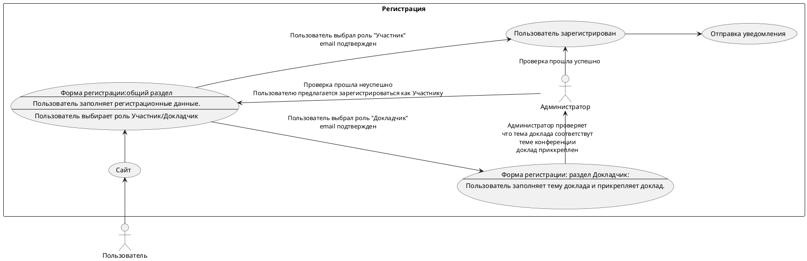

# Описание требований и архитектуры

## Введение
<!-- Общее краткое описание создаваемой системы -->
В рамках курса осуществляется проектирование решения на основе [постановки задачи от "заказчика"](../../task.md).

- [Описание требований и архитектуры](#описание-требований-и-архитектуры)
  - [Введение](#введение)
  - [Заинтересованные стороны](#заинтересованные-стороны)
  - [Бизнес-контекст (бизнес-требования)](#бизнес-контекст-бизнес-требования)
  - [Глоссарий](#глоссарий)
  - [Модель предметной области](#модель-предметной-области)
  - [Требования к системе](#требования-к-системе)
    - [Сценарии использования (Use case)](#сценарии-использования-use-case)
    - [Функциональные требования](#функциональные-требования)
    - [Нефункциональные требования/Требования к атрибутам качества](#нефункциональные-требованиятребования-к-атрибутам-качества)
    - [Ограничения](#ограничения)
  - [Архитектура](#архитектура)
    - [Журнал архитектурных решений](#журнал-архитектурных-решений)
    - [Контекст решения](#контекст-решения)
    - [Компонентная архитектура](#компонентная-архитектура)
    - [Реализация сценариев использования](#реализация-сценариев-использования)
    - [Программные интерфейсы](#программные-интерфейсы)
    - [Схема развертывания](#схема-развертывания)
  
## Заинтересованные стороны
<!-- Перечень заинтересованных сторон и их интересов по отношению к создаваемой системе. 
Подробнее: https://confluence.mts.ru/pages/viewpage.action?pageId=399975538 
-->
| Заинтересованная сторона | Интересы                          |
|:-------------------------|:----------------------------------|
| Организаторы             |Проведение мероприятия, увеличение охвата заинтересованных лиц и ЦА, привлечение спонсоров |	
| Докладчики | Продвижение докладчика, развитие личного бренда, популяризация темы|	 
| Целевая аудитория	|	 Интересная тема форума, новые докладчики, обмен мнениями, личное развитие|
| Спонсоры форума | Реклама своих продуктов и услуг, популяризация бренда|
|Городские власти | Популяризация бренда, выход на новую аудиторию, лояльность аудитории, реклама продуктов и услуг| 
|Правообладатели товарных знаков|Популяризация бренда, выход на новую аудиторию,лояльность аудитории, реклама продуктов и услуг|    

## Бизнес-контекст (бизнес-требования)
<!-- Общее описание бизнес-контекста создаваемой системы (автоматизируемой деятельности), список бизнес-целей заинтересованных сторон 
Подробнее: https://confluence.mts.ru/pages/viewpage.action?pageId=399973845
--> 
- Для привлечения целевой аудитории и повышения узнаваемости бренда необходимо провести конференцию в режиме он-лайн с привлечением не менее 10 топовых спикеров длительностью не менее 4-х часов.
- Конференция должна обеспечить продвижение компании на рынке образовательных услуг.

## Глоссарий
<!-- Содержит основные понятия и термины предметной области  
Подробнее: https://confluence.mts.ru/pages/viewpage.action?pageId=375782595
-->
| Понятие                        | Сокращение                         | Определение                       |
|:-------------------------------|:-----------------------------------|:----------------------------------|
| Регистрация                    |  | Процесс получения доступа к мероприятию|
| Регламеннт | | Лимит времени предоставляемый для презентации доклада |
| Расписание | | Последовательность и длительность выступлений  |
| Пользователь || Лицо желающее принять участие в конференции
| Участник | |Зарегистрированный польззователь с возможностью просмотра выступлений | 
| Докладчик||Выступающий участник |
|Администратор||Участник не принимающий непосредственного участия в конференци, обладающий правами доступа ко всем данным системы|
|Технический специалист|| Участник не принимающий непосредственного участия в конференци, обеспечивающий техническое сопровождение конференции|
|Система||Програмно-аппаратный комплекс обеспечивающий проведение мероприятия|

## [Модель предметной области](data/data.md)

## Требования к системе

### Сценарии использования (Use case)
<!-- Подробное описание сценариев использования системы с привязкой к ролям участников и задействованным бизнес-сущностям 
https://confluence.mts.ru/pages/viewpage.action?pageId=375782108 
https://confluence.mts.ru/pages/viewpage.action?pageId=375782119 
-->
#### Диаграмма сценариев использования (Use Case Diagram) <!-- omit in toc -->

#### Список сценариев использования <!-- omit in toc -->

| ID     | Описание                                          |
|--------|---------------------------------------------------|
| UC.001 | *[Регистрация](uc/uc.001.md)* |
| UC.002 | *[Трансляция](uc/uc.002.md)* |
| UC.003 | *[Рассылка](uc/uc.003.md)* |

### Функциональные требования
<!-- Описание требований к функциям, реализуемым системой. Требование может быть привязано к сценарию использования или быть общим 
Подробнее: https://confluence.mts.ru/pages/viewpage.action?pageId=375782501 
-->
| ID     | Функциональное требование             |
|--------|---------------------------------------|
| FR.001 | Реализовать функционал «Расписание форума», который  должен содержать a) Название форума (возможно использовать как переменную в письмах  уведомлениях) b) Дату форума (возможно использовать как переменную в письмах  уведомлениях); c) Время начала форума (возможно использовать как переменную в письмах  уведомлениях); d) Время окончания форума (возможно использовать как переменную в письмах  уведомлениях); e)Кол-во одновременных треков (например: трек «Карьера», трек «Бизнес» и т.д.)| 
|FR.002 |Должна быть реализована статусная модель для формы «Расписание форума»:a)	В работе; b)	Утверждён.|  
|FR.003| Должна быть реализована возможность графического отображения в формате расписания всех занятых временных слотов с указанием темы и докладчика. |
|FR.004|Должна быть реализована возможность перетаскивать карточки «Докладов» во временным слотам без изменения темы и спикера, но с фиксацией изменения времени доклада;
|FR.005|После смены статуса на «Утверждён» всем докладчикам должно автоматически быть направлено уведомление о дате, времени и итоговой теме его доклада на email, указанный в форме регистрации.|
|FR.006|Должен быть реализован функционал, позволяющий автоматически направлять на почту пользователям сообщение в случае срабатывания определённого триггера. |
|FR.007|Должны быть реализованы переменные,которые при подстановке в текст письма должны автоматически заполнять значения полей. Например, должна быть использована переменна NAME, при проставлении которой в письме должна происходить автоматическая замена на поле «Имя» из формы регистрации того пользователя, на чей email будет осуществлена отправка письма.|
|FR.008|Список переменных должен формироваться вручную путем заполнения для каждой переменной: 1.Имени переменной;2.Связки с полями СУБД.|
|FR.009|Каждое автоматически направляемое письмо должно содержать:1.Заголовок, соответствующий триггеру;2.	Унифицированный текст с набор переменных, при необходимости.|
|FR.010|Cписок переменных должен формироваться вручную путем заполнения для каждой переменной:1.Имени переменной;2.	Связки с полями СУБД.|
|FR.011|Триггерами для отправки писем должны быть следующие ситуации:Регистрация нового пользователя на сайте: helloconf.mts.ru;Изменение статуса заявки пользователя «Докладчик»;Уведомление для докладчиков о итоговой дате, времени и теме доклада;Напоминание о предстоящем мероприятие за определённое кол-во времени;Уведомления о начале избранного мероприятия.|
|FR.0012 |Каждый пользователь сети Интернет должен иметь доступ на сайт helloconf.mts.ru;|
|FR.0013 |Для регистрации Участника должа открываться форма регистрации участника, содержащая следующий набор полей:a)	Фамилия. Обязательное поле;b)	Имя. Обязательное поле;c)	Отчество. Необязательное поле;d)	Логин. Обязательное поле;e)	Email. Обязательное поле;f)	Пароль. Обязательное поле;g)	Подтверждение пароля. Обязательное поле.|
|FR.0014 |Пользователь должен иметь возможность выбрать формат участия:a)	«Участник»;b)	«Докладчик».|
|FR.0015 |При необходимости набор полей формы «Участника» может быть расширен.|
|FR.0016 |Участник должен иметь возможность:1) Просматривать итоговую версию документа «Расписание форума», которая должна быть опубликована на сайте (....).|
|FR.0017 |Участник должен иметь возможность при нажатии на любую сессию просматривать потоковое видео с докладом по заданной теме;}
|FR.0018 |Участник по окончании доклада должен иметь возможность оценить выступление докладчика путем проставления от 0 до 5 звезд.|
|FR.0019 |Должен быть реализован функционал "Личный кабинет" с возможностью формирования списка выбранных мероприятий| 
|FR.0020 |В случае, если пользователь выбирает формат участия «Докладчик», должна открываться форма форма «Персональные данные»:Паспорт (серия, номер). Обязательное поле.	Дата выдачи. Обязательное поле;Место выдачи. Обязательное поле;Фотография. Обязательное поле;Регион проживания. Обязательное поле;Адрес проживания. Обязательное поле;Согласие на обработку персональные данных. Обязательное поле;|
|FR.0021 | Для Докладчика должна открываться форма "Доклад" содержащая поля:Предлагаемые темы докладов. Обязательное поле;Выбор длительности доклада. Обязательное поле;Формат участия (онлайн / офлайн). Обязательное поле;Участие в аналогичных форумах. Обязательное поле.Ссылка на персональную страничку в соц.сетях. Обязательное поле.Ссылки на примеры выступления. Обязательное поле.|
|FR.0022 |После заполнения всех полей Участнику на email, указанный в форме регистрации должна быть направлена информация об учётных данных для доступа на портал.
|FR.0023 |До тех пор, пока Администратор не подтвердил формат участника как Докладчик в личном кабинете на сайте должен отображаться статус «На проверке».|
|FR.0024 |В случае, если Администратор подтвердил формат участия пользователя «Докладчик», пользователь «Докладчик» должен получить на почту соответствующее уведомление.|
|FR.0025 |После изменения статуса пользователя на «Докладчик» пользователь должен получить доступ в личный кабинет с расширенным функционалом, включающим:a)	Возможность просмотра карточки докладчика;b)	Возможность просмотра карточки «Доклада» включая тему доклада,дату проведения доклада, время начала и окончания выступления;c)	Возможность загрузки итогового файла презентации формата PDF или PPTX.|
|FR.0026 |«Администратор» должен создаваться во внутреннем интерфейсе системы, без возможности создать пользователя с такими ролями с помощью открытой в сети Интернет формы.|
|FR.0027 |Администратор должен иметь возможность просмотра всех логов системы;|
|FR.0028 |Администратор должен иметь возможность технического администрирования системы|
|FR.0029 |Администратор должен иметь возможность создания всех таблиц БД;|
|FR.0030 |Администратор должен иметь возможность заполнения, внесения изменений и удаления всех таблиц, справочников и т.д системы.|
|FR.0031 |Администратор должен иметь возможность возможность просмотра списка участников форума;|
|FR.0032 |Администратор должен иметь возможность контроля поступления новых заявок «Докладчика»;|
|FR.0033 |Администратор должен иметь возможность подтверждения или отказа статуса «Докладчик»;|
|FR.0034 |Администратор должен иметь возможность зафиксировать за каждым докладчиком темы его доклада, трека и времени начала и окончания выступления;|
|FR.0035 |Администратор должен иметь возможность cоздания карточки «Доклад» для каждого спикера с указание даты, времени начала и окончания доклада и его докладчика;|
|FR.0036 |Администратор должен иметь возможность	контроля поступления новых файлов с докладами;|
|FR.0037 |Администратор должен иметь возможность	согласования новых докладов;|
|FR.0038 |Администратор должен иметь возможность создания треков форума с указание даты, времени начала и окончания трека форума;|
|FR.0039 |Администратор должен иметь возможность	формирования расписания сессий форума;
|FR.0040 |Администратор должен иметь возможность	контроля загрузки «Докладчиками» итоговых версий презентаций;|
|FR.0041 |Администратор должен иметь возможность	создания формы обратной связи для каждой сессий со списком вопросов;|
|FR.0042 |Все действия Администратора по изменению статуса участников форума должны логироваться.|
|FR.0043 |После изменения формы участия на «Докладчик», на почту, указанную в форме регистрации должно быть направлено письмо с уведомлением участника;|
|FR.0044 |Автоматическое письмо должно содержать всю информацию необходимую для взаимодействия участника и организаторов.|
|FR.0045 |Технический специалист должен создаваться во внутреннем интерфейсе системы, без возможности создать пользователя с такими ролями с помощью открытой в сети Интернет формы|
|FR.0046 |Технический специалист должен иметь возможность просмотра списка текущих сессий;|
|FR.0047 |Технический специалист должен иметь возможность просмотра списка «Докладчиков» и их докладов;|
|FR.0048 |Технический специалист должен иметь возможность контроля наличия файла формата PDF или PPTX;|
|FR.0049 |Технический специалист должен иметь возможность запуска новых сессий «Докладчиков»;
|FR.0050 |Технический специалист должен иметь возможность вставки рекламных блоков спонсоров;|
|FR.0051 |Технический специалист должен иметь возможность вставки музыкальных блоков между сессиями;|
|FR.0052 |Технический специалист должен иметь возможность настройки потокового видео для каждой сессии;|
|FR.0053 |Технический специалист должен иметь возможность настройки комнат сессий, в случае, если параллельно идёт несколько сессий;|
|FR.0054 |Реализовать функционал "Трансляция" который должен позволить зарегистрированному пользователю поключиться к конференции;|
|FR.0055 |Функционал "Трансляция" должен иметь возможность просмотра выбранного доклада;|
|FR.0056 |Функционал "Трансляция" должен иметь возможность  переключения между треками и докладами|
|FR.0057 |Функционал "Трансляция" должен иметь возможность обратной связи с докладчиком;|
|FR.0058 |Функционал "Трансляция" должен иметь иметь форму оценки доклада;|
  

### Нефункциональные требования/Требования к атрибутам качества
<!-- Требования к основным архитектурным характеристикам (атрибутам качества) системы - надежность, масштабируемость, ИБ, и др.
Подробнее: https://confluence.mts.ru/pages/viewpage.action?pageId=375782530
-->
1) Система должна подходить для проведения аналогичных форумов большего масштаба с не менее чем 1000 участников и 20 докладчиков;
2) Сайт должен быть доступен пользователям  из Российской федерации в течении 99% всего времени;
3) Система должна поддерживать стабильную работу при подключении 1000 одновременных зрителей;
4) Хранение персональных данных должно соответствовать 152-ФЗ;
5) Сайт форума должен отображаться корректно во всех популярных браузерах.

| ID     | Атрибут качества             | Описание требования                       |
|--------|------------------------------|-------------------------------------------|
| QR.001 | *Масштабируемость* | Должна быть реализована возможность проведения аналогичного мероприятия на большую целевую аудиторию без потери качества. Требование будет считаться успешно выполненным при условии, что аналогичная конференция будет включать аудиторию не менее 1000 участников и 20 докладчиков. |
| QR.002 | *Доступность* |Система должна быть доступна в сети Интернет пользователям из Российской федерации в течении 99% всего времени |
| QR.003 | *Надежность* |Должно быть проведено нагрузочное тестированивание, по результатам которого определена предельная нагрузка Системы. Как результат система должна быть отказоустойчивой при подключении не менее чем 1500 одновременных зрителей.|
| QR.004 | *Безопасность* | Сервер хранения данных должен быть расположен на террирории РФ, защищен с помощью антивируса. Доступ к персональным данным должен быть ограничен только администратором системы. Таблица, хранящая персональные данные участников форума должна быть зашифрована по алгоритму... Все загружаемые файлы должны проверяться на наличие вирусов перед тем, как быть загружены на основной сервер. Должна быть реализована распереденная система хранения данных - персональные данные должны храниться в изолированном хранилище и на отдельном сервере от фалов - презентаций, загружаемых спикерами форума.|
| QR.005 | *Кроссплатформенность* |Система должна быть доступна в следующих браузерах:Chrome (версия не ниже....), Safari (версия не ниже...), firefox (версия не ниже ...).|

### Ограничения
<!-- Описываются ограничения, оказывающие влияние на архитектуру системы - временные, финансовые, технологические
Подробнее: https://confluence.mts.ru/pages/viewpage.action?pageId=375782592
-->
| ID     | Ограничение            |
|--------|------------------------|
| AC.001 | А качестве СУБД следует использовать MySQL для поддержания целостности данных (ACID)|
| SC.002 | Масштабирование на количетво пользователей большее чем  указано в  QR.001 не рассматривается в рамках данного проекта|
## Архитектура

### Журнал архитектурных решений
<!-- Записи о ключевых принятых архитектурных решениях (ADR) для реализации архитектурно-значимых требований.
Подробнее: https://confluence.mts.ru/pages/viewpage.action?pageId=421162308
-->
- [ADR.001 MySQL выбрана в качестве СУБД для платформы проведения конференции](adr/adr-template.md)

### [Контекст решения](context/context.md)

### [Компонентная архитектура](components/components.md)

### Реализация сценариев использования
<!-- Реализация сценариев использования на основе взаимодействия компонентов системы и внешних систем/участников.
Диаграммы последовательности (UML Sequence diagram) и текстовое описание.

Подробнее: 
https://confluence.mts.ru/pages/viewpage.action?pageId=399442132
https://confluence.mts.ru/pages/viewpage.action?pageId=399442170
-->
| ID     | Описание                          | Реализация                                    |
|--------|-----------------------------------|-----------------------------------------------|
| UC.001 | *Название сценария использования* | [Реализация сценария](uc-impl/uc.001-impl.md) |

### Программные интерфейсы
<!-- Спецификации публичных API системы и ее компонентов (синхронных, событийных). Создается на основе модели предметной области для реализации сценариев использования. 
  Форматы: OAS/Swagger, GraphQL, AsyncAPI/CloudEvents
-->
| Компонент             | Интерфейс                                      |
|:----------------------|:-----------------------------------------------|
| *Название компонента* | *[Название интерфейса](api/service-name.yaml)* |

### [Схема развертывания](deployment/deployment.md)
